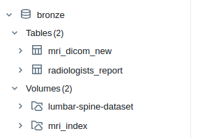
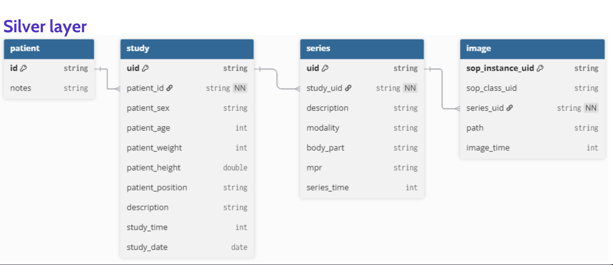
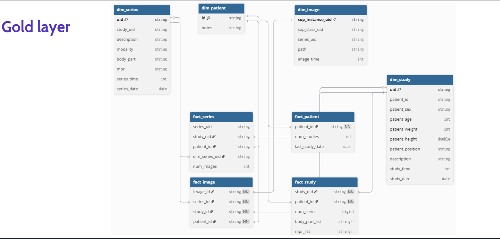
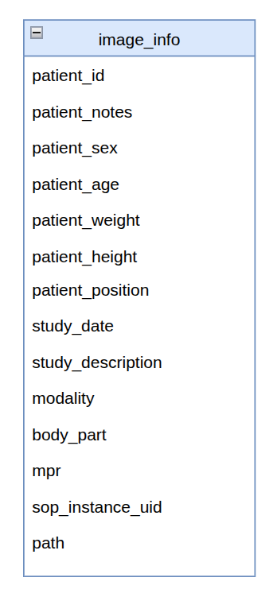
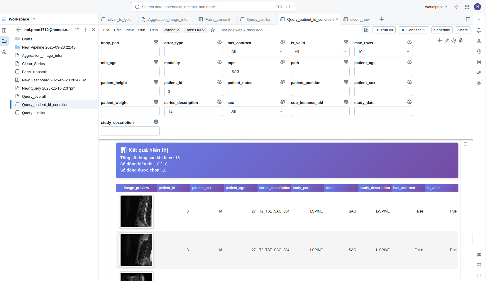
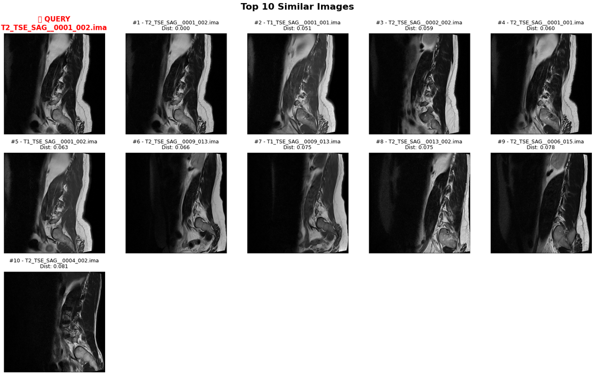

# BigData-BI_Databrick

## Medallion Structure:

### Bronze_layzer

### Silver_layer

### Gold_layer

### Aggreation table:

## BI:

Query followed by id, features

Query followed by top k similar images:

